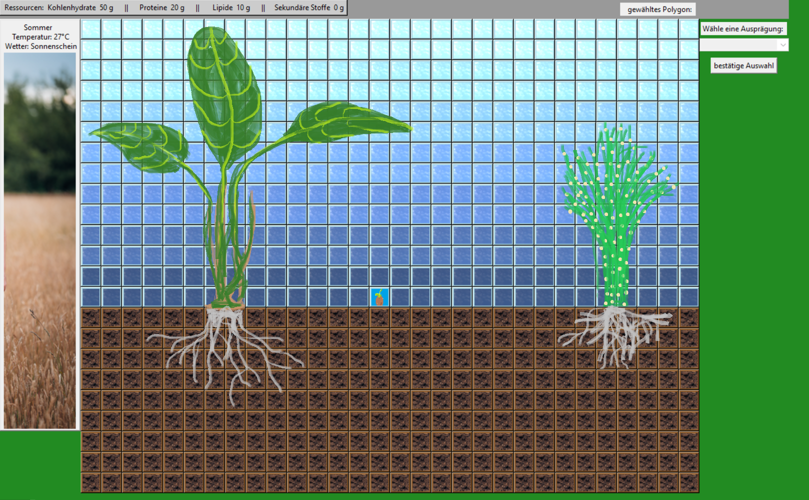

PLANTAS

this game was my first project witch was entirely written with pyhton. some functionalities were already implemented. For example, a plant with differentiated leaves, shoots or branches and roots could be created.
The development was stopped because the scope of the game would have become too big and I wanted to concentrate fully on the frontend development.

